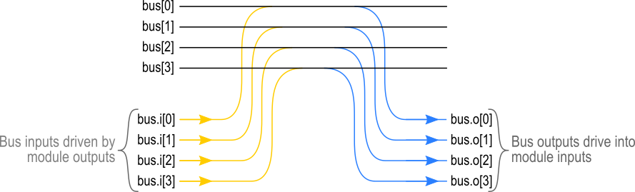

# Usage

## Accessing PygMyHDL

To use pygmyhdl in a project:

    import pygmyhdl

## Syntax Features

PygMyHDL adds several syntax features to standard MyHDL.

### Wire Class

A `Wire` object is a one-bit Boolean signal.
It is declared like this:

    my_wire = Wire(0)

The same thing in MyHDL would be:

    my_wire = Signal(bool(0))

The `Wire` constructor takes the following optional arguments:

`init_val`:

:    A Boolean value that defines the initial value of the signal.
     If no value is given, it defaults to zero.

         my_wire = Wire(1)  # Create wire with initial value of 1.
         my_wire = Wire(init_val=0)  # Create wire with initial value of 0.
         my_wire = Wire()   # Create wire with initial value of 0.

`name`:

:    A string containing a name for the [myhdlpeek](http://xesscorp.github.io/myhdlpeek)
     monitor that will be attached to the signal.
     If no value is given, it defaults to `None` and no signal monitor will be attached.

         my_wire = Wire(name='monitor_name')  # Create wire with signal monitor called `monitor_name`.
         my_wire = Wire()  # Create wire without a signal monitor.

### Bus Class

A `Bus` object is a multi-bit signal.
It is declared like this:

    my_bus = Bus(3)  # Declare a three-bit bus.

The same thing in MyHDL would be:

    my_bus = Signal(modbv(0)[3:])

The `Bus` constructor takes the following arguments:

`width`:

:    This integer argument is required and specifies the bit-width of the bus.

         my_bus = Bus(8)  # Declares an 8-bit bus.
         my_bus = Bus(width=10)  # Declares a 10-bit bus.

`init_val`:

:    An integer value that defines the initial value of the signal.
     If no value is given, it defaults to zero.

         my_bus = Bus(8, 123)  # Create an 8-bit bus with initial value of 123.
         my_bus = Bus(8)       # Create an 8-bit bus with initial value of 0.

`name`:

:    A string containing a name for the [myhdlpeek](http://xesscorp.github.io/myhdlpeek)
     monitor that will be attached to the signal.
     If no value is given, it defaults to `None` and no signal monitor will be attached.

         my_bus = Bus(8, name='bus_name')  # Create an 8-bit bus with signal monitor called `bus_name`.
         my_bus = Bus(8)  # Create an 8-bit bus without a signal monitor.

`vtype`:

:    A type that will be used for the signal.
     If no type is given, it defaults to `modbv`.

         my_bus = Bus(16, intbv)  # Create a 16-bit bus of type intbv.
         my_bus = Bus(16)         # Create a 16-bit bus of type modbv.

`Bus` objects have the following additional properties:

`.o`

:    Provides access to the *output bits* of a bus.
     This are used when passing the value on a bus to another module:

         a = Bus(8)
         b = Bus(8)
         mod_out = Wire()
         my_module(a.o[0], b.o[0], mod_out)  # my_module receives inputs from LSBit of buses a and b.

     The same operation in MyHDL would be:

         my_module(a(0), b(0), mod_out)

`.i`

:    Provides access to the *input bits* of a bus.
     This is used when placing the output from a module onto the bus:

         a = Bus(8)
         b = Bus(8)
         c = Bus(8)
         my_module(a.o[3:0], b.o[3:0], c.i[3:0])  # Bus c gets the result output.

     The same operation in MyHDL would be:

         tmp = Signal(intbv(0)[8:])
         my_module(a(3,0), b(3,0), tmp)
         @always_comb
         def xfer_func():
             c[3:0].next = tmp

Note that the `.i` and `.o` properties are meant for passing bus bits to/from a module.
When operating on a bus *within* a module, the standard MyHDL array operator (`[]`) is used.
There is one exception to this: if you want to set a static value on one or more bits of a `Bus` object
such as this:

    my_bus = Bus(8)
    my_bus.i[0] = 1  # Set the LSBit of my_bus to one.

### State Class

A `State` object stores the state of a finite-state machine (FSM).
It is declared like this:

    my_state = State('St1', 'St2', 'St3')

The same thing in MyHDL would be:

    state_t = enum('St1', 'St2', 'St3')
    my_state = state_t()

The initial arguments to the `State` constructor are either a list of strings for the state names:

    my_state = State('St1', 'St2', 'another_state', 'final_state')

Or you can pass an existing `State` object to create another one just like it:

    my_next_state = State(my_state)  # Use my_state to create my_next_state.

Finally, you can access the `enum` type for a `State` object and use that to create a new one:

    my_next_state = State(my_state.s)  # Use the state type for an existing state to create a new one.

In addition to the list of states, the `State` constructor takes the following arguments:

`init_val`:

:    A Boolean value that defines the initial value of the signal.
     If no value is given, it defaults to zero.

         my_wire = Wire(1)  # Create wire with initial value of 1.
         my_wire = Wire(init_val=0)  # Create wire with initial value of 0.
         my_wire = Wire()   # Create wire with initial value of 0.

`name`:

:    A string containing a name for the [myhdlpeek](http://xesscorp.github.io/myhdlpeek)
     monitor that will be attached to the state signal.
     If no value is given, it defaults to `None` and no signal monitor will be attached.

         my_state = State('A', 'B', 'C', name='fsm_state')  # Create state variable with signal monitor called `fsm_state`.

Finally, any other named arguments are passed through to the `enum` function.
So you can specify things like the state encoding scheme.

As shown previously, each `State` object keeps a record of its `enum` type under the `.s` attribute.
This provides access to the allowable states for doing state comparisons and assignments:

    my_state = State('st1', 'st2', 'st3')
    if my_state == my_state.s.st1:      # Compare to see what state in my_state is in.
        my_state.next = my_state.s.st2  # Update my_state with a new state.

### @chunk Decorator

Place the `@chunk` decorator before the definition of a module like so:

    @chunk
    def adder(a, b, s):
        @comb_logic
        def logic():
            s.next = a + b

The `@chunk` decorator inserts some code to manage the implicit addition of module instances
to the global list of module instances.
It is *not* related to the `@block` decorator in standard MyHDL in any way.

### @comb_logic Decorator

Place the `@comb_logic` decorator before the definition of a combinational logic function
inside a module like so:

    @chunk
    def adder(a, b, s):
        @comb_logic
        def logic():
            s.next = a + b

`@comb_logic` is equivalent to the use of the `@always_comb` decorator in standard MyHDL
but it also assists in implicitly adding the function to the global list of instances.

### @seq_logic Decorator

Place the `@seq_logic` decorator before the definition of a sequential logic function
inside a module like so:

    @chunk
    def counter(clk, cnt):
        @seq_logic(clk.posedge)  # Update counter on the rising edge of clock.
        def logic():
            cnt.next = cnt + 1

`@seq_logic` takes one parameter that specifies the edge of the clock that triggers the
sequential logic (either `posedge` or `negedge`).

`@seq_logic` is equivalent to the use of the `@always_comb` decorator in standard MyHDL
but it also assists in implicitly adding the function to the global list of instances.

### Module Instantiation

Unlike standard MyHDL, PygMyHDL doesn't require explicit calls to `instances()` or
the return of module instantiations.
Instead, PygMyHDL maintains a global list of instantiations to which modules are
added whenever they are called.
So instead of doing this in MyHDL:

    m = my_module(a, b, c)  # Instantiate module and capture the instance object.
    return m                # Return instance object.

You would do the following in PygMyHDL:

    my_module(a, b, c)  # Automatically places the module instantiation on the global module list.

(Note that this requires you to use the `@chunk` decorator for the modules you
define in PygMyHDL.

## Simulation Functions

PygMyHDL provides several functions to make simulation easier.

### simulate()

This function takes a test bench function and simulates it along with whatever modules
are on the global list:

    def tb():
        for _ in range(100):
            clk.next = 1
            yield delay(1)
            clk.next = 0
            yield delay(1)

    simulate(tb())

### random_sim()

This function applies random inputs to a module instance:

    @chunk
    def my_module(a, b, c):
        ...

    a, b, c = Wire(), Wire(), Wire()
    my_module(a, b, c):
    random_sim(a, b, c, num_tests = 5)  # Apply 5 random combinations of a, b, c to my_module.

The first set of positional arguments to `random_sim` are the signals (either
`Wire` or `Bus` objects) that are assigned random value.
The named arguments are as follows:

`num_tests`:

:    An integer specifying the number of random input combinations to apply.

`dly`:

:    The number of time units to insert between each input combination.

#### exhaustive_sim()

This function applies every possible combination of inputs to a module instance:

    @chunk
    def my_module(a, b, c):
        ...

    a, b, c = Wire(), Wire(), Wire()
    my_module(a, b, c):
    exhaustive_sim(a, b, c)  # Apply all 8 combinations of a, b, c to my_module.

The first set of positional arguments to `exhaustive_sim` are the signals (either
`Wire` or `Bus` objects) that are assigned values.
The named arguments are as follows:

`dly`:

:    The number of time units to insert between each input combination.

### clk_sim()

This function applies a specified number of pulses to a signal (usually a clock):

    @chunk
    def my_module(clk):
        ...

    clk = Wire()
    my_module(clk):
    clk_sim(clk, num_cycles = 5)  # Apply 5 pulses to clk.

The first set of positional argument to `clk_sim` is the signal (usually a
`Wire` objects) that will accept the pulses.
The named arguments are as follows:

`num_cycles`:

:    An integer specifying the number of pulses (1-0) to apply.

`dly`:

:    The number of time units to insert between each pulse edge.

### vector_sim()

This function applies sets of values to one or more signals:

    @chunk
    def my_module(a, b):
        ...

    a = Bus(3)
    b = Bus(8)
    my_module(a, b):
    vector_sim([a, [0, 1, 2, 3, 4]], [b, [255, 254, 253, 252, 251]])

The first set of positional arguments to `vector_sim` are lists with the
first element being a signal (either a `Wire` or `Bus` object) followed by
a vector of values that will be applied to that signal.
The named arguments are as follows:

`num_cycles`:

:    An integer specifying the number of values to apply to the signals.
     If not given, the number of cycles is set to the maximum of the number of values
     of all the signal lists.

`dly`:

:    The number of time units to insert between each value.

## Examples

Below are some examples of Jupyter notebooks using PygMyHDL.
Unfortunately, the Github Notebook viewer doesn't render the waveform displays
so you'll have to download and run the notebooks locally or click on the static HTML
link to see what PygMyHDL can do.

* The Fastest, Easiest FPGA Blinker, Ever!:
  [Notebook1](https://github.com/xesscorp/pygmyhdl/blob/master/examples/1_blinker/fastest_easiest_FPGA_blinker_ever.ipynb) /
  [HTML1](http://www.xess.com/static/media/pages/pygmyhdl/examples/1_blinker/fastest_easiest_FPGA_blinker_ever.html)

* Hierarchy and Abstraction and Ursidae, Oh My!:
  [Notebook2](https://github.com/xesscorp/pygmyhdl/blob/master/examples/2_hierarchy/hierarchy_and_abstraction_and_ursidae_oh_my.ipynb) /
  [HTML2](http://www.xess.com/static/media/pages/pygmyhdl/examples/2_hierarchy/hierarchy_and_abstraction_and_ursidae_oh_my.html)

* Pulse Width Modulators:
  [Notebook3](https://github.com/xesscorp/pygmyhdl/blob/master/examples/3_pwm/pwm.ipynb) /
  [HTML3](http://www.xess.com/static/media/pages/pygmyhdl/examples/3_pwm/pwm.html)

* Block (RAM) Party!:
  [Notebook4](https://github.com/xesscorp/pygmyhdl/blob/master/examples/4_blockram/block_ram_party.ipynb) /
  [HTML4](http://www.xess.com/static/media/pages/pygmyhdl/examples/4_blockram/block_ram_party.html)

* FSMs Without Monsters!:
  [Notebook5](https://github.com/xesscorp/pygmyhdl/blob/master/examples/5_fsm/fsm.ipynb) /
  [HTML5](http://www.xess.com/static/media/pages/pygmyhdl/examples/5_fsm/fsm.html)
